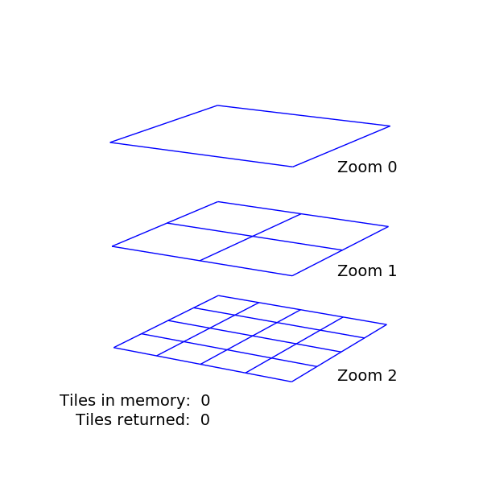

# GeoDex

GeoDex is tool to find tile indices for geospatial work on satellite imagery. Given **(1)** a geojson file containing at least one polygon boundary and **(2)** a zoom level, GeoDex will return all satellite imagery [tile indices](http://www.maptiler.org/google-maps-coordinates-tile-bounds-projection/) that at least partially overlap the boundary. Returned tile indices can be written to a text file for further processing.

## Installation
`pip install geodex`

## Basic usage example 1
Specify only a geojson file and zoom:
```
geodex test/roi_single.geojson 12
```
Returns:
```
2494 2126 12
2494 2125 12
2493 2126 12
2493 2125 12
```
## Basic usage example 2
Also specify output format string:
```
geodex test/roi_single.geojson 12 'google' --output-format "{z}-{x}-{y}"
```
Returns:
```
12-2494-2126
12-2494-2125
12-2493-2126
12-2493-2125
```

## Typical usage
Write output of boundary to text file
Note that using `>` like below will **overwrite** `tile_indices.txt` if it exists.
```
geodex zone_1.geojson 15 'tms' > tile_indices.txt
```

Avoid overwrite by **appending** multiple outputs to text file using `>>`
```
geodex zone_1.geojson 15 'tms' >> tile_indices.txt
geodex zone_17.geojson 15 'tms' >> tile_indices.txt
```

## Additional details
GeoDex is optimized to use very little RAM (compared to our previous tool, [`cover.js`](https://github.com/developmentseed/skynet-train/blob/master/cover.js)). It uses a depth-first search algorithm that continually returns tile indices instead of storing all tiles in memory at once (see toy example below). This ensures that the program won't crash due to memory overflow as full tile lists can grow to a few gigabytes. The total runtime generally depends on the number of tiles (determined by boundary size and zoom level) as well as the roughness of the boundary.

Tile indexing is built on top of [pyGeoTile](https://github.com/geometalab/pyGeoTile).

### Toy example


### Scripting with GeoDex
Command line functionality is mostly insulated from the core code. Therefore, you can incorporate this algorithm into a script by catching `sys.stdout` with something like [`contextlib`'s `redirect_stdout`](https://docs.python.org/3.4/library/contextlib.html#contextlib.redirect_stdout). 

GeoDex was developed during a [project to map high-voltage electricity lines](https://www.developmentseed.org/ml-grid-docs/) that was supported by the [World Bank](http://www.worldbank.org/).

## See also

GeoDex has some overlapping functionality with [mercantile](http://mercantile.readthedocs.io/en/latest/index.html) as both can get all indices within a bounding region. If your geojson specifies a single rectangle, Mercantile can be faster. However, GeoDex will also properly handle geojsons specifying an arbitrary (non-rectangular) polygon or multiple polygons within the same geojson. Additionally, GeoDex uses [pyGeoTile](https://github.com/geometalab/pyGeoTile) to obtain tile indices for specific bounding regions, so it has some added features like the ability to request all three handle three major tile formats (Google, TMS, and QuadTree).